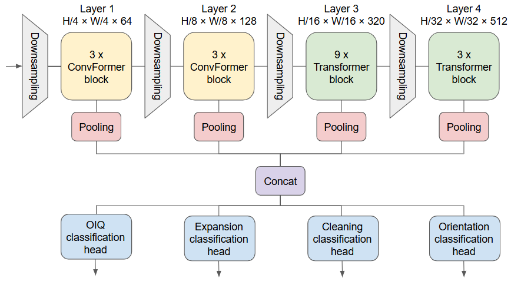

# CADq: Image Quality Assessment for Barrett's Esophagus Endoscopy

> **Extending image quality assessment system on top of pretrained CADe backbone for Barrett's esophagus**  
> *SPIE Medical Imaging 2026*

**Authors:** Justus M.A. van de Beek<sup>a</sup>, Tim J.M. Jaspers<sup>a</sup>, Christiaan G.A. Viviers<sup>a</sup>, Joost A. van der Putten<sup>c</sup>, Carolus H.J. Kusters<sup>a</sup>, Martijn R. Jong<sup>b</sup>, Rixta A.H. van Eijck van Heslinga<sup>b</sup>, Floor Slooter<sup>b</sup>, Albert J. de Groof<sup>b</sup>, Jacques J. Bergman<sup>b</sup>, Peter H.N. De With<sup>a</sup>, and Fons van der Sommen<sup>a</sup>

<sup>a</sup> Eindhoven University of Technology, Eindhoven, The Netherlands  
<sup>b</sup> Amsterdam University Medical Centers, Amsterdam, The Netherlands  
<sup>c</sup> Theta Vision, Eindhoven, The Netherlands

## Abstract

Computer-aided detection and diagnosis (CADe/x) systems in gastrointestinal endoscopy frequently underperform in routine clinical practice due to variable and suboptimal image quality. We propose a lightweight computer-aided quality (CADq) module that reuses feature representations from a pretrained CADe model to enable real-time image quality assessment. Using annotated esophageal endoscopy images, we investigate whether a frozen CaFormer-S18 backbone, originally trained for Barrett's esophagus neoplasia detection, can be repurposed for four CADq tasks: **overall image quality (OIQ)**, **mucosal cleaning**, **esophageal expansion**, and **procedural orientation**. Analyses of the pretrained feature space demonstrate that substantial task-relevant quality information is already encoded in the backbone. Lightweight two-layer MLP decoder heads operating on frozen features achieve strong performance across all tasks, with macro-AUROC values of 0.870 for OIQ, 0.927 for esophageal expansion, and 0.938 for mucosal cleaning, indicating that diagnostically trained representations are sufficient for reliable quality assessment. Backbone fine-tuning provides only marginal performance gains relative to the additional computational cost. This shared-backbone design reduces training and inference complexity while maintaining high predictive performance, supporting practical integration of CADq into clinical endoscopic workflows and improving the robustness and interpretability of downstream CADe/x systems.

## Model Architecture

The system consists of two main components:

1. **Backbone (CaFormer-S18):** A MetaFormer-based vision transformer pretrained and fine-tuned for CADe of Barrett's esophagus. It produces hierarchical feature maps at four spatial resolutions:
   - Level 1: `(B, 64, 56, 56)`
   - Level 2: `(B, 128, 28, 28)`
   - Level 3: `(B, 320, 14, 14)`
   - Level 4: `(B, 512, 7, 7)`

2. **Classification Heads:** Lightweight heads attached to one (or all concatenated) backbone feature levels. Each head independently predicts one quality criterion:

   | Head | Classes | Labels |
   |------|---------|--------|
   | `clean` | 3 | Poor / Adequate / Good mucosal cleaning |
   | `expansion` | 3 | Poor / Adequate / Good luminal expansion |
   | `oiq` | 3 | Poor / Adequate / Good overall image quality |
   | `retro` | 2 | Insertion view / Retrograde view |



## Project Structure

```
cadq/
├── src/
│   ├── config.py              # CLI argument parsing and experiment configuration
│   ├── data_module.py         # PyTorch Lightning DataModule
│   ├── dataset.py             # Dataset loading and label parsing from JSON annotations
│   ├── preprocess.py          # ROI detection and image preprocessing
│   ├── transforms.py          # Data augmentation and normalization transforms
│   ├── metrics.py             # Evaluation metrics (AUROC, MAE, AUPRC)
│   ├── experiments.sh         # Shell script to reproduce all paper experiments
│   ├── modeling/
│   │   ├── train.py           # Training loop (cross-validation + final training)
│   │   ├── losses.py          # Weighted cross-entropy loss
│   │   └── callbacks.py       # Per-head metric recording callback
│   └── models/
│       ├── MetaFormer.py      # CaFormer-S18 architecture definition
│       ├── backbones.py       # CaformerBackbone wrapper with weight loading
│       ├── heads.py           # FeatureStudyHead and MlpHead classification heads
│       ├── model_base.py      # ModelBase combining backbone + head
│       └── model_module.py    # PyTorch Lightning ClassificationModule
├── notebooks/
│   ├── data_splitting.ipynb   # Train/test split creation
│   ├── features.ipynb         # Feature-level analysis and visualization
│   ├── visualize_data.ipynb   # Dataset exploration and annotation statistics
│   └── test.ipynb             # Model evaluation on the held-out test set
├── requirements/
│   └── base.txt               # Pinned dependencies
└── readme.md
```

## Citation

If you use this code in your research, please cite:

```bibtex
@inproceedings{cadq2026,
  title     = {Extending image quality assessment system on top of pretrained CADe backbone for Barrett's esophagus},
  author    = {van de Beek, Justus M.A. and Jaspers, Tim J.M. and Viviers, Christiaan G.A. and van der Putten, Joost A. and Kusters, Carolus H.J. and Jong, Martijn R. and van Eijck van Heslinga, Rixta A.H. and Slooter, Floor and de Groof, Albert J. and Bergman, Jacques J. and De With, Peter H.N. and van der Sommen, Fons},
  booktitle = {SPIE Medical Imaging},
  year      = {2026}
}
```


